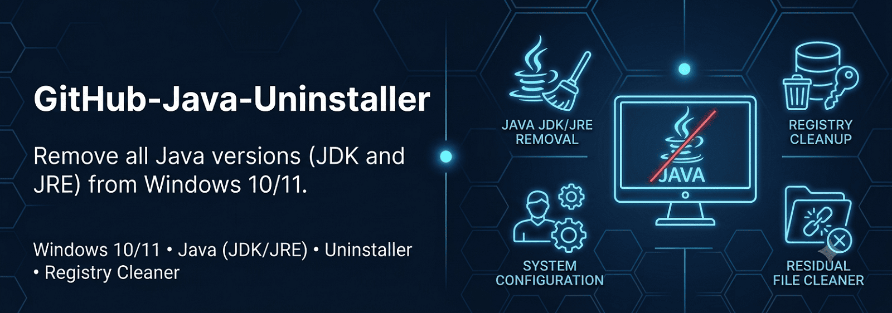

# Java Uninstaller for Windows

Script for the **complete, automated removal of Java** from Windows 10 and Windows 11: it closes running processes, uninstalls packages, cleans up leftover folders, registry keys, the `JAVA_HOME` variable, and Java entries in `PATH`.

## 📦 Project files

| File | Description |
|---|---|
| `uninstall-java.bat` | Main script, run this one |
| `uninstall-java.ps1` | PowerShell module invoked by the batch script (must stay in the same folder) |

## ✨ Features

- ✅ Compatible with **Windows 10** and **Windows 11**
- ✅ Automatic administrator elevation, with anti-loop protection
- ✅ Explicit confirmation required before proceeding (Y/N)
- ✅ Automatically closes active Java processes (`java.exe`, `javaw.exe`, `javaws.exe`)
- ✅ Uninstalls via **winget** (Java, OpenJDK, Eclipse Temurin, Zulu)
- ✅ Uninstalls via **PowerShell** (`Get-Package` / `Uninstall-Package`)
- ✅ Silently uninstalls via native **registry Uninstall** entries, matched by `DisplayName` (covers MSI installers too, not just winget/Get-Package)
- ✅ Removes leftover folders (Oracle, Adoptium, Zulu, AdoptOpenJDK)
- ✅ Cleans up `JavaSoft` registry keys
- ✅ Removes the `JAVA_HOME` environment variable (system and user)
- ✅ Cleans up Java-related entries in `PATH` (system and user)
- ✅ Detailed log of the operation (`uninstall-java-log.txt`)

## 🚀 Usage

1. Download **both** files (`uninstall-java.bat` and `uninstall-java.ps1`) into the same folder
2. Right-click `uninstall-java.bat` and choose "Run as administrator" (or just run it normally — it will request elevation on its own)
3. Confirm the operation when prompted (Y/N)
4. Wait for the process to complete
5. Restart your PC to apply the changes

> ⚠️ **Warning:** this script removes **all** Java versions installed on the system, including any OpenJDK/Temurin/Zulu distributions. Make sure you don't have applications depending on Java before running it.

## 📋 Requirements

- Windows 10 or Windows 11
- `winget` installed (included by default on Windows 11 and recent Windows 10 builds) — if missing, the script automatically skips this step without raising errors
- Administrator privileges

## 📄 Log

A `uninstall-java-log.txt` file is generated in the same folder as the script once execution completes, useful for checking which components were actually removed or whether any errors occurred.

## 🛠️ How it works

1. **Close processes** – terminates any running Java processes to avoid locked files
2. **Winget** – uninstalls the most common Java packages (if winget is available on the system)
3. **PowerShell (`uninstall-java.ps1`)** – removes packages detected via `Get-Package`, finds registry Uninstall entries with a `DisplayName` matching Java/JDK/JRE/OpenJDK/Temurin/Zulu and silently uninstalls them (handling both MSI and NSIS/InstallShield installers), then cleans up `PATH` from any Java references
4. **File system cleanup** – deletes leftover Oracle/OpenJDK/Temurin/Zulu folders
5. **Registry and environment cleanup** – removes the `JavaSoft` keys and the `JAVA_HOME` variable

## 🤝 Contributing

Pull requests and issue reports are welcome! If you find a Java path or installer not covered by the script, please open an issue.

## 📜 License

Distributed under the [MIT](LICENSE) license.

---

Made by [lorenzocaputodev](https://github.com/lorenzocaputodev)
