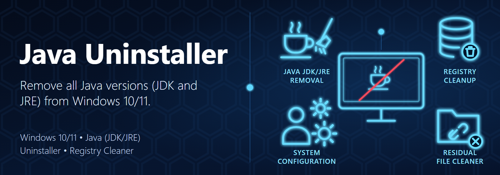

# Java Uninstaller for Windows

[](https://github.com/lorenzocaputodev/java-uninstaller/actions/workflows/ci.yml) [](https://github.com/lorenzocaputodev/java-uninstaller/releases/latest) [](LICENSE) 

Script for the **complete, automated removal of Java** from Windows 10 and Windows 11: it closes running Java processes, uninstalls every Java distribution it finds, and cleans up leftover folders, registry keys, `JAVA_HOME` and Java entries in `PATH`. It can preview everything first (dry run) and it backs up what it changes.

## 📦 Project files

| File | Description |
|---|---|
| `uninstall-java.bat` | Main script, run this one (elevation and confirmation) |
| `uninstall-java.ps1` | Removal engine invoked by the batch script (must stay in the same folder) |
| `tests/uninstall-java.tests.ps1` | Automated tests for the detection and cleanup logic |
| `CHANGELOG.md` | Version history |

## ✨ Features

- ✅ Compatible with **Windows 10** and **Windows 11** (Windows PowerShell 5.1, built in)
- ✅ Automatic administrator elevation, with anti-loop protection and a clear error if it is denied
- ✅ Explicit choice before proceeding: **[Y]** uninstall, **[D]** dry run, **[N]** cancel
- ✅ **Dry run**: shows every process, package, folder, registry key and `PATH` entry that would be affected, and changes nothing
- ✅ **Backup** before any change: environment variables and Java registry keys are exported to `.reg` files
- ✅ Detects Oracle Java, OpenJDK, Eclipse Temurin / Adoptium, AdoptOpenJDK, Azul Zulu, Amazon Corretto, BellSoft Liberica and Microsoft Build of OpenJDK
- ✅ Uninstalls via **winget** (exact package IDs, so several installed versions are not a problem)
- ✅ Silently uninstalls every matching entry of *Programs and Features* (MSI and non-MSI), with a timeout so a stuck uninstaller cannot hang the script
- ✅ Removes leftover folders, `JavaSoft` and vendor registry keys
- ✅ Removes `JAVA_HOME`, `JDK_HOME`, `JRE_HOME` (system and user)
- ✅ Cleans Java entries in `PATH` (system and user) without touching the other entries: `%VARIABLES%` and the `REG_EXPAND_SZ` type are preserved
- ✅ Stops before deleting folders and registry keys if a product could not be uninstalled
- ✅ Detailed log (`uninstall-java-log.txt`) and meaningful exit codes

## 🚀 Usage

1. Download **both** files (`uninstall-java.bat` and `uninstall-java.ps1`) into the same folder, or download the repository as a ZIP
2. Right-click `uninstall-java.bat` and choose "Run as administrator" (or just run it normally, it will request elevation on its own)
3. **Recommended:** choose **[D]** first to preview what would be removed
4. Run it again and choose **[Y]** to perform the removal
5. Restart your PC to apply the changes

> ⚠️ **Warning:** this script removes **all** Java versions installed on the system, including any OpenJDK/Temurin/Zulu/Corretto distributions, and **forcefully terminates every running `java.exe` / `javaw.exe`** (Gradle daemons, servers, games with their own runtime...). Save your work and make sure you don't have applications depending on Java before running it.

## 📋 Requirements

- Windows 10 or Windows 11
- Administrator privileges
- `winget` is optional: if missing, the script skips that step and relies on the registry step

## 📄 Log and backup

Both are created next to the script (or in `%TEMP%` if that folder is not writable):

- `uninstall-java-log.txt`: everything that was found, done or skipped, and every warning. It is recreated at each run.
- `uninstall-java-backup-<date>-<time>\`: `.reg` exports of the machine and user environment keys (this is where `PATH` and `JAVA_HOME` live) and of every Java registry key before it is deleted. To restore something, double-click the relevant `.reg` file.

## 🔍 What exactly is removed

| Area | Scope |
|---|---|
| Processes | `java`, `javaw`, `javaws`, `jp2launcher`, `jusched`, `jucheck` |
| Packages | winget IDs `Oracle.JDK*`, `Oracle.JavaRuntimeEnvironment`, `EclipseAdoptium.Temurin*`, `Azul.Zulu*`, `Microsoft.OpenJDK*`, `Amazon.Corretto*`, `BellSoft.Liberica*`, `AdoptOpenJDK*` |
| Programs and Features | entries named `Java ...`, `Java(TM) ...`, `*OpenJDK*`, `*Temurin*` / `*Adoptium*`, `Azul Zulu` / `Zulu JDK`, `Amazon Corretto`, `*Liberica*`, or containing the words `JDK` / `JRE`; plus any Oracle/Sun product with `Java` in its name |
| Folders | `Java`, `Eclipse Adoptium`, `AdoptOpenJDK`, `Zulu`, `Amazon Corretto`, `Common Files\Oracle\Java`, `Microsoft\jdk-*`, `BellSoft\LibericaJDK-*` in `Program Files` and `Program Files (x86)`; `ProgramData\Oracle\Java`; `%AppData%\Oracle\Java`; `%LocalAppData%\Oracle\Java`; `AppData\LocalLow\Sun\Java` |
| Registry | `JavaSoft` (HKLM, WOW6432Node, HKCU), `Eclipse Adoptium`, `AdoptOpenJDK`, `Azul Systems\Zulu`, `Amazon\Corretto`, `Microsoft\JDK` |
| Environment | `JAVA_HOME`, `JDK_HOME`, `JRE_HOME`; `PATH` entries that point to the folders above, to a `jdk-*` / `jre-*` `bin` folder, to `%JAVA_HOME%` or to the old `JAVA_HOME` folder |

Anything not listed (for example a Java installed from a ZIP in a custom folder) is left alone: use the dry run to see what will happen. If a custom `JAVA_HOME` folder still exists after the run, the log tells you.

## 🛠️ How it works

1. **Backup** – exports the environment and Java registry keys
2. **Close processes** – terminates running Java processes to avoid locked files
3. **Winget** – resolves the exact IDs of the installed Java packages and uninstalls them
4. **Native uninstallers** – finds the matching *Programs and Features* entries and uninstalls them silently (MSI via `msiexec /x`, others via their quiet uninstall command), then checks that nothing is left
5. **Folders** – deletes leftover folders (skipped if a product failed to uninstall)
6. **Registry** – deletes the `JavaSoft` and vendor keys (skipped if a product failed to uninstall)
7. **Environment** – removes the Java variables and Java `PATH` entries, then notifies running applications

### Exit codes

| Code | Meaning |
|---|---|
| `0` | Completed, nothing left behind |
| `1` | Completed with warnings (see the log) |
| `2` | Fatal error, e.g. not administrator or backup failed (nothing was changed) |

### Notes

- If you elevate with **a different administrator account**, HKCU, `%AppData%` and the *user* `PATH` cleaned by the script belong to that account, not to the one you use every day.
- Running `uninstall-java.ps1 -DryRun` directly is safe. Running it without `-DryRun` skips the confirmation of the batch launcher: use `uninstall-java.bat` instead.

## 🧪 Development

```powershell
powershell -NoProfile -ExecutionPolicy Bypass -File tests\uninstall-java.tests.ps1
```

CI (GitHub Actions) also runs PSScriptAnalyzer, checks that the scripts are ASCII with CRLF line endings, and runs a dry run. The `.bat` and `.ps1` files are stored with CRLF and are **not** normalized by Git (see `.gitattributes`): keep them that way when editing.

## 🤝 Contributing

Pull requests and issue reports are welcome! If you find a Java distribution, path or installer not covered by the script, please open an issue (attach the dry-run log if you can).

## 📜 License

Distributed under the [MIT](LICENSE) license.

---

Made by [lorenzocaputodev](https://github.com/lorenzocaputodev)
